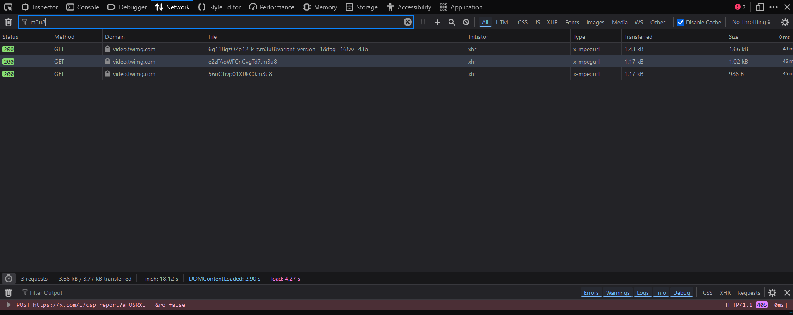

# Twitter Video Download Script

This repository provides a simple Python script to download Twitter videos using the `ffmpeg` tool. Since Twitter uses a `blob` format to stream videos with separate audio and video tracks, we need to combine these tracks manually. This script allows you to extract the audio and video streams using `.m3u8` files and combine them into a single MP4 file using `ffmpeg`.

## How It Works

Twitter uses separate streams for video and audio. By using browser developer tools, we can capture the links to these streams, then use `ffmpeg` to download and combine them. Here’s an outline of the steps involved:

1. Open the Twitter video page.
2. Use **Inspect** (right-click and choose "Inspect" or press `Ctrl+Shift+I`).
3. Refresh the page and go to the **Network** tab.
4. Filter by `.m3u8`.
5. You will see three requests:
   - One for **metadata** (ignore this).
   - One for the **video**.
   - One for the **audio**.
6. Copy the **video** and **audio** `.m3u8` links.
7. Use the provided Python script to download and combine them.

## Prerequisites

- Install Python 3.x
- Install `ffmpeg`

### To install `ffmpeg`, you can follow these steps:

1. Download [FFmpeg](https://ffmpeg.org/download.html) and install it.
2. Add `ffmpeg` to your system's PATH variable (optional but recommended).

## Usage

1. Clone or download this repository.
2. Install `ffmpeg` on your system.
3. Run the script in your terminal:
   ```bash
   python downloader.py


Make sure to replace the video_url and audio_url in the script with the actual .m3u8 links you capture from the Network tab in the browser.
Screenshot of How to Inspect and Identify Links



## Notes

    This script is specifically for downloading Twitter videos that use blob format streams.
    You can change the output file path to your desired location.
    Ensure you have the correct .m3u8 links for both video and audio streams.

## Troubleshooting

    If you encounter errors during downloading or combining, ensure that:
        The .m3u8 links are correct.
        You have installed ffmpeg correctly.
        The video and audio streams match (same resolution, compatible codecs).
